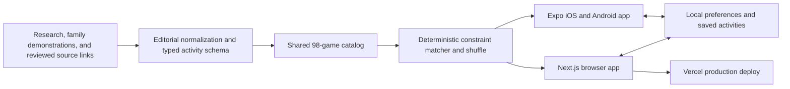

# Try This Fun

**One good thing to do together, right now.**

Try This Fun is an account-free family play recommender for the moments when a
parent wants to connect but cannot think of an activity that fits the time,
energy, people, and materials available. The same reviewed 98-game catalog runs
in the browser and in the Expo mobile app.

- Live prototype: [trythis.fun](https://trythis.fun)
- iOS beta: [TestFlight](https://testflight.apple.com/join/WTFUxxpm)
- Final pitch deck: [`docs/hackathon/Try-This-Hackathon-Deck.pdf`](docs/hackathon/Try-This-Hackathon-Deck.pdf)
- Final 4:08 walkthrough: [`docs/hackathon/Try-This-Fun-Final-Walkthrough.mp4`](docs/hackathon/Try-This-Fun-Final-Walkthrough.mp4)
- Submission copy: [`docs/DEVFOLIO_SUBMISSION.md`](docs/DEVFOLIO_SUBMISSION.md)

No judge account or test credentials are required. The web product is playable
in any modern browser.

## The problem

Family time often disappears into deciding what to do. Search results provide
long lists, vague social posts, activities requiring unavailable supplies, or
instructions too incomplete for a tired parent to use immediately. The problem
is not a shortage of ideas; it is selecting and explaining one suitable idea at
the right moment.

## The solution

Try This asks for a small amount of situational context—desired kind of play,
setup tolerance, and available time—then deals one compatible activity. Every
activity has a concise promise, clear starting line, complete instructions,
variations, and a recovery path. Families may also browse or search the entire
collection, save favorites locally, and follow an original demonstration when
watching is more useful than reading.

The first featured collection preserves four Kannada heritage games with
Kannada lyrics, transliteration, original family demonstrations, and illustrated
play cards. The broader catalog remains globally useful and includes movement,
making, storytelling, guessing, performance, and real-family-job activities.

## How it works

The prototype deliberately uses a deterministic recommendation pipeline rather
than a runtime LLM. This keeps suggestions fast, explainable, inexpensive, and
safe to use without transmitting family data.

1. Editors promote a researched activity into a typed content schema.
2. The shared adapter converts native activities, conversation formats, and
   source-backed ideas into one web/mobile catalog.
3. The matcher applies hard constraints such as mode, materials, and duration.
4. If an exact combination is empty, it relaxes secondary constraints while
   retaining the requested mode.
5. A Fisher–Yates shuffle randomizes the compatible deck and avoids immediately
   repeating the current card.
6. The selected card opens locally with instructions, artwork, optional video,
   and the original source link where applicable.
7. Saved activities remain in the browser or device local storage.

Simplified matching logic:

```ts
const exact = catalog.filter(activity =>
  matchesMode(activity, choice.mode) &&
  matchesSetup(activity, choice.setup) &&
  matchesDuration(activity, choice.duration)
)

const candidates = exact.length ? exact : catalog.filter(activity =>
  matchesMode(activity, choice.mode)
)

return shuffle(candidates).find(activity => activity.id !== previousId)
```

## System architecture



The browser build is a statically exported Next.js application. It does not
need an application server, database, login provider, or remote recommendation
API for the current MVP. GitHub verifies every web change, and Vercel deploys
`main` automatically to `trythis.fun`.

## Tech stack

| Surface | Technology |
| --- | --- |
| Web | Next.js 16, React 19, TypeScript, static export, Vercel |
| Native | React Native 0.81, Expo SDK 54, Expo Router |
| Local data | Browser `localStorage`; AsyncStorage, SQLite, and SecureStore capabilities on native |
| Content | Typed TypeScript activity schema with shared web/native adapters |
| Media | Optimized WebP artwork and browser-friendly MP4 demonstrations |
| Delivery | GitHub Actions checks, Vercel web deployment, EAS/TestFlight/Google Play builds |

## Run the web app locally

Requirements: Node.js 22 and npm.

```bash
git clone https://github.com/mirrorphotosintern/bonding.git
cd bonding/web
npm install
npm run dev
```

Open [http://localhost:3000](http://localhost:3000). The public MVP requires no
environment variables because the catalog, matching, artwork, and videos are
served with the static application.

Verification:

```bash
npm run check
```

## Run the native app locally

Requirements: Node.js 22, npm, Expo tooling, and Xcode or Android Studio for a
simulator.

```bash
git clone https://github.com/mirrorphotosintern/bonding.git
cd bonding
npm install
npm run ios
```

Use `npm run android` for Android or `npm run ios:native` when a custom native
build is required.

## Repository map

```text
Bonding/
├── app/         Expo Router screens
├── src/         shared native types, catalog, matcher, and services
├── web/         Next.js browser product
├── web/public/  optimized artwork and demonstration videos
├── docs/        research, product, content, architecture, and submission files
└── .github/     continuous-integration checks
```

## MVP scope and feasibility

The final prototype already supports the complete account-free journey:

- choose a moment and receive a randomized compatible activity;
- browse and search the complete reviewed catalog;
- open complete instructions, variations, artwork, videos, and source links;
- save favorites locally without creating an account;
- play the same catalog on responsive web, iOS, and Android surfaces; and
- deploy web changes automatically from `main`.

Six-month roadmap:

1. Add optional, privacy-preserving feedback: tried, repeated, skipped, and why.
2. Use aggregate outcomes to improve ranking without profiling children.
3. Invite culture bearers to publish reviewed regional heritage collections.
4. Add multilingual audio and transliteration packs.
5. Launch the production iOS App Store and Android Play Store apps with shared
   releases, offline media, and a one-time family unlock.
6. Build educator, library, and community-organization collection bundles.

## Privacy

Try This is designed for family use without collecting children's personal
information. The public web prototype requires no account and stores favorites
only in the current browser. See the live [Privacy Policy](https://trythis.fun/privacy/).

## Team

Try This Fun is built by husband-and-wife team **Kumar Sridharamurthy** and
**Lavanya Shirur Sudhakar**, inspired by the everyday challenge of finding
better ways to spend time with their six-year-old son and two-year-old daughter.

Bonding is the internal repository codename; **Try This Fun** is the public
product name.
