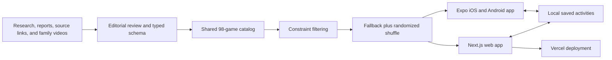

# Try This Fun — Final Devfolio Submission

Canonical final-submission copy for Kumar Sridharamurthy and Lavanya Shirur
Sudhakar. All claims below describe the working prototype unless explicitly
marked as roadmap.

## Project name

Try This Fun

## Tagline

One good thing to do together, right now.

## Project links

- Working prototype: [https://trythis.fun](https://trythis.fun)
- Source repository: [https://github.com/mirrorphotosintern/bonding](https://github.com/mirrorphotosintern/bonding)
- Final walkthrough: [https://trythis.fun/hackathon/try-this-fun-final-walkthrough.mp4](https://trythis.fun/hackathon/try-this-fun-final-walkthrough.mp4)
- Pitch deck: [https://trythis.fun/hackathon/Try-This-Hackathon-Deck.pdf](https://trythis.fun/hackathon/Try-This-Hackathon-Deck.pdf)
- Privacy policy: [https://trythis.fun/privacy/](https://trythis.fun/privacy/)
- iOS TestFlight: [https://testflight.apple.com/join/WTFUxxpm](https://testflight.apple.com/join/WTFUxxpm)

No login or judge credentials are required.

## A. Concept and impact

### Problem statement

We are a husband-and-wife team with a six-year-old son and a two-year-old
daughter. We kept running into the same small but important problem: we wanted
to spend better time together, but when everyone was tired or impatient we
could not think of something that fit the moment. Searching the web gave us
endless lists, vague social posts, or activities that needed supplies we did
not have.

The internet does not have an idea shortage. Families have a selection and
execution problem. A useful activity must fit the available time, energy,
people, place, and materials—and it needs to explain exactly how to begin.

### Solution overview

Try This Fun replaces a long search with one practical suggestion. A family
chooses the kind of play they want, the setup they can handle, and the time they
have. A deterministic matcher filters the reviewed catalog, randomizes the
compatible deck, and deals one clearly explained activity. If that suggestion
does not fit, the next deal stays fresh.

Each activity includes a short promise, an opening line, complete instructions,
variations, a recovery idea, custom illustration, and an original demonstration
link where watching helps. The browser product is completely account-free.
Favorites stay in that browser.

Our first featured collection preserves four Kannada heritage games for young
children. Instead of naming a rhyme and assuming the parent already knows it,
we include Kannada lyrics, easy transliteration, family demonstration videos,
illustrations, and the physical actions needed to play. The broader catalog is
globally useful and covers movement, making, stories, guessing, performance,
and everyday family jobs.

### Target users

- Parents and caregivers of children roughly 18 months through 10 years old.
- Families who have only 3–20 minutes and want something immediately doable.
- Multigenerational and diaspora families preserving games that are often
  passed down orally and are difficult to discover or explain online.
- Libraries, schools, parent groups, and cultural organizations that want
  ready-to-run, low-preparation family activities.

### Current impact

The working prototype removes sign-up, search, and preparation from the path to
play. It preserves oral heritage in a form a new parent can actually use, while
the global catalog makes the product useful beyond one language or community.
The design has already gone through repeated simulator and browser iterations:
we removed redundant filters, exposed one primary recommendation action,
randomized the deck, expanded incomplete activity cards, restored original
source links, and replaced generic artwork with a consistent visual system.

The next validation phase will measure whether families start an activity,
repeat it, save it, or immediately ask for another. We will report behavioral
results rather than inventing testimonials before that testing is complete.

## B. Technical architecture

### System design

The MVP is intentionally local-first. The recommendation path does not require
a backend database, authentication service, or runtime LLM. That makes the
prototype fast, explainable, inexpensive to operate, and appropriate for
family use without transmitting children's data.

### How the matching logic works

1. Every reviewed activity is normalized into structured fields including
   mode, duration, materials, place, participant limits, age bands, tags,
   instructions, media, and source provenance.
2. The browser and native adapters consume the same canonical catalog.
3. User choices become hard filters for mode, setup, and duration.
4. When no exact result exists, secondary constraints relax while the primary
   requested mode remains intact.
5. A Fisher–Yates shuffle randomizes the compatible candidates.
6. The current activity ID is excluded where possible, preventing immediate
   repeats.
7. Opening and saving a card happens locally. Source links leave the app only
   when the user deliberately opens the original demonstration.

### Tech stack

- Next.js 16, React 19, and TypeScript for the responsive browser product.
- React Native 0.81, Expo SDK 54, and Expo Router for iOS and Android.
- Typed TypeScript schemas and adapters for the shared 98-game catalog.
- Browser `localStorage` and native local-storage capabilities for preferences
  and saved activities.
- WebP artwork and browser-friendly H.264 MP4 demonstrations.
- GitHub Actions for type and production-build checks.
- Vercel for automatic production deployment to `trythis.fun`.
- EAS Build, App Store Connect/TestFlight, and Google Play tooling for native
  releases.

## C. Execution roadmap

### MVP scope and feasibility

The working MVP already provides:

- an account-free responsive browser product;
- a shared reviewed catalog across web, iOS, and Android;
- constraint-based recommendation with randomized ordering;
- browsing, category filtering, and search;
- complete activity instructions and variations;
- custom game artwork, heritage demonstrations, and source links;
- local saved activities; and
- automated web build verification and production deployment.

### If we had six more months

1. Add optional feedback—tried, repeated, skipped, and why—without collecting
   children's identity.
2. Improve ranking from aggregate outcomes while keeping the matcher
   explainable.
3. Add curated heritage collections with community review and attribution.
4. Add multilingual audio guidance, captions, and transliteration packs.
5. Launch the production iOS App Store and Android Play Store apps with shared
   releases, offline media, and a one-time family unlock instead of a recurring
   subscription.
6. Pilot family-play bundles with libraries, schools, and cultural
   organizations.

## D. Code repository

[https://github.com/mirrorphotosintern/bonding](https://github.com/mirrorphotosintern/bonding)

The repository is private during the hackathon; grant the judging team read
access before the final deadline. Its root README contains local setup,
architecture, the matching algorithm, privacy choices, repository structure,
and roadmap.

## E. Functional prototype

[https://trythis.fun](https://trythis.fun)

The entire experience works without sign-up in a modern browser. Judges can:

1. watch the founder and heritage-game introduction;
2. open one of the illustrated Kannada games and watch its family demonstration;
3. filter by mood, setup, and time and receive a randomized recommendation;
4. open the selected game for full instructions;
5. browse or search the full catalog; and
6. save an activity locally.

## F. Video demonstration

Final 4:08 walkthrough:
[https://trythis.fun/hackathon/try-this-fun-final-walkthrough.mp4](https://trythis.fun/hackathon/try-this-fun-final-walkthrough.mp4)

- 0:00–0:30 — the family problem and why we built Try This Fun.
- 0:30–1:30 — live homepage and Kannada heritage collection.
- 1:30–2:30 — open a visually strong game and show its video and instructions.
- 2:30–3:30 — choose a mood, setup, and time; deal and open a recommendation.
- 3:30–4:15 — browse/search another activity, show source provenance and saved
  state, then close with the impact.

## G. Business viability

Try This can scale as a low-infrastructure consumer product because the current
recommendation experience is static and local-first. The catalog is the
compounding asset: every reviewed collection increases usefulness without
requiring a more expensive runtime architecture.

The planned commercial model is a free starter collection with a single,
one-time family unlock for the complete library and offline media. Expansion
paths include sponsored cultural-preservation collections, educator/library
bundles, and commissioned regional packs. We will validate willingness to pay
with ads and landing-page conversion before adding payment complexity.

## Challenges we ran into

### Turning messy inspiration into playable instructions

Many promising ideas existed only as a tweet, short video, title, or one-line
note. We reviewed the source material, removed activities that depended on
unexplained knowledge or did not make sense, preserved useful source links, and
converted the good ideas into a consistent schema. Every publishable card
needed enough detail for a tired parent to begin without guessing.

### Designing a recommendation instead of another overwhelming catalog

Our early versions exposed filters, counts, and long grids. That recreated the
decision fatigue we wanted to solve. We redesigned the core journey around a
few practical choices and one prominent action, while keeping browse and
search available for families who already know what they want.

### Making safety useful without making play sound clinical

Family activities need sensible supervision, but defensive language can drain
the fun out of a game. We edited the writing so important guidance appears
where it matters while the main instructions stay warm, specific, and playful.

### Shipping one coherent product across three surfaces

The native app uses Expo and React Native; the browser product uses Next.js.
The shared catalog and visual system prevent them from becoming separate
products. We also built release assets, local persistence, privacy disclosures,
responsive layouts, TestFlight delivery, Google Play setup, and automatic
Vercel deployment.

## Team

- **Kumar Sridharamurthy** — product, engineering, and operations
- **Lavanya Shirur Sudhakar** — product, content, heritage research, and design

We are husband and wife, and the problem is our own: finding better ways to
spend time with our six-year-old son and two-year-old daughter.
