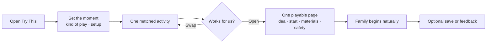

# Try This — Product Specification

**Status:** Concept specification  
**Internal codename:** Bonding  
**Consumer name:** Try This

> **Global product boundary:** Try This is a standalone product for families worldwide. It has no Kannada, Indian, diaspora, or language-learning positioning. International games may appear when they are independently understandable, safely adapted, properly attributed, and enjoyable outside their culture of origin.
**Positioning line:** One small thing. Fully together.  
**Primary platforms:** iOS and Android  
**Primary audience:** Caregivers of children ages 3–10  
**Document date:** 2026-07-26

## Existing prototype baseline

The sibling `/connectplay` project is a working static idea bank with 74 cards: 44 founder-saved/source-linked records and 30 researched additions. It validates provenance browsing and basic filtering, but it is not the Try This product described here. Try This should migrate qualified content while preserving raw notes and URLs; it should not port ConnectPlay's many-card grid into the one-match Today experience. See `CONNECTPLAY_IMPLEMENTATION_AUDIT.md`.

## 1. Product summary

Try This helps a tired or time-poor caregiver find one safe, low-prep thing to do with a child right now. It asks only what matters in the moment—who is here, time, place, energy, and available materials—then recommends one shared challenge.

The matched idea page is the experience: it explains what the idea is, how to
start, and any materials or safety notes without adding another start ritual.
Families begin naturally whenever they are ready. The app never orders the
adult to put the phone down or makes them enter a separate play mode.

The fastest version of this promise is often a zero-prop conversation game chosen for a car ride, restaurant wait, queue, or bedtime. It is recommended by the same matcher and presented through the same idea flow as every other activity. Its rule is explainable in one breath, the phone can go down within 15 seconds, and the family can stop cleanly whenever the real-world wait ends.

Try This is inspired by Hearty's useful premise—age-tailored offline bonding—but it is not a Hearty clone. Its defensible product idea is a **context-to-completion system**:

1. understand the actual family moment;
2. choose one activity rather than expose a feed;
3. help the adult prepare safely;
4. transfer attention away from the device;
5. preserve a small family signal about what worked;
6. use that signal to improve future matches.

## 2. The problem

Parents do not lack ideas. They have screenshots, bookmarks, social posts, craft boards, toys, and advice. They lack retrieval and activation at the moment when a child says “I’m bored” and the adult has seven minutes before dinner.

Existing solutions tend to fail in one of five ways:

- **Idea overload:** long category grids replace one form of scrolling with another.
- **Aspirational prep:** the activity assumes materials, space, energy, and patience the family does not have.
- **Screen-time contradiction:** the product keeps the child watching a tutorial instead of doing the activity.
- **Generic personalization:** age is captured once, but current energy, location, mess tolerance, mobility, and number of participants are ignored.
- **Parenting pressure:** streaks, child scores, and development claims turn connection into another obligation.

The user's real question is:

> “Given the child in front of me and the energy I have left, what is one thing we can actually enjoy together now?”

## 3. Product principles

### 3.1 The app should disappear

Success is not session length. Success is a quick handoff from device to relationship. Product analytics should reward completed real-world sessions and short in-app dwell time.

### 3.2 The adult is not homework

The product must work for “low battery” adults. It should never scold, prescribe an ideal family routine, or frame a skipped day as lost progress.

### 3.3 The child is a collaborator

Activities give children agency: choose the color, invent the next rule, teach the adult, lead a round, judge the trick, or decide when the activity is done.

### 3.4 Safety is content, not a footer

Age fit, choking hazards, allergens, sharp tools, heat, water, falls, strangulation, small parts, supervision, cultural sensitivity, and accessibility are structured fields reviewed before publication.

### 3.5 Claims stay modest

The app may describe the skills an activity practices—turn-taking, coordination, observation, vocabulary—but it must not promise to make a child smarter, diagnose a delay, or imply a guaranteed developmental outcome.

### 3.6 No copied social-media content

Saved posts are inspiration and evidence of demand, not a licensed content library. Every published activity requires original instructions, original or licensed media, a safety review, and provenance notes.

## 4. Audience

### 4.1 Primary persona: the depleted but willing parent

- Child age: 3–8
- Has 5–20 minutes
- Usually opens the app during a transition
- Wants a concrete answer, not education about why play matters
- Common constraints: cooking, another sibling, small apartment, weather, no special supplies
- Fear: creating more mess or starting something the child abandons
- Success: the child engages and the adult does not need to perform enthusiasm

### 4.2 Secondary persona: the intentional weekend parent

- Child age: 4–10
- Has 30–90 minutes
- Wants a build, outing, family game, or teachable skill
- Will gather a few materials
- Values an activity that can grow across attempts
- Success: the family makes or learns something they want to try again

### 4.3 Secondary persona: the grandparent or visiting caregiver

- Needs clear, large, non-technical instructions
- May have mobility or hearing constraints
- Often brings stories, tricks, household skills, and intergenerational knowledge
- Success: the adult can lead confidently without setting up an account

### 4.4 Secondary persona: two or more children

- Needs roles and age adjustments, not a one-child assumption
- Requires cooperative variants and ways to avoid a younger child simply losing
- Success: everyone has a meaningful job and the adult is not constantly refereeing

### 4.5 Non-target users for v1

- Infants under 3: materially different safety and developmental requirements
- Teens: require autonomy, identity, and relationship patterns beyond this first product
- Child-only use: Try This is adult-operated
- Clinical therapy or developmental treatment
- Co-parenting logistics, custody communication, or family scheduling

## 5. Jobs to be done

### Functional jobs

- Give me an activity that fits this exact moment.
- Give me something we can play immediately with no materials.
- Tell me what I need before my child sees it.
- Help me start without reading an article.
- Adjust the idea for multiple ages or limited mobility.
- Let us continue without looking at the screen.
- Remember what this child genuinely liked.

### Emotional jobs

- Reduce “I should be doing more” guilt.
- Help me feel present without demanding perfection.
- Let my child experience me as interested and responsive.
- Make ordinary family time feel memorable.
- Help us recover after a disconnected or difficult day.

### Social jobs

- Give grandparents and other caregivers a confident way in.
- Create small family rituals and repeatable games.
- Let a family share an outcome privately without exposing a child publicly.

## 6. Positioning

### Category

Parent-child togetherness app.

### For

Caregivers who want less passive screen time and more real interaction but do not have the energy to plan it.

### Try This is

A context-aware activity guide that chooses one doable thing and gets the phone out of the way.

### Unlike

Activity feeds, craft boards, behavior trackers, parenting courses, and child-facing edtech.

### It wins because

It is optimized for **completion under real constraints**, not content consumption.

### App Store subtitle

**One small thing to do together**

### Short description

Tell Try This where you are, how much time you have, and what energy is left. Get one safe, age-fit activity with everything you need to begin.

## 7. Core product loop

The loop must work without sign-in. An adult can complete onboarding and the first session locally; account creation appears only when cloud sync, family sharing, or a paid feature requires it.

## 8. Information architecture

### Primary navigation

1. **Today** — answer two lightweight moment questions, then receive one matched activity.
2. **Saved** — favorites and reliable family hits.
3. **Profile** — family setup, preferences, subscription, privacy, and help.

The idea detail page is a normal stack route outside the tab hierarchy.
The catalog browser remains an internal editorial/testing route, not primary
customer navigation.

### Why three tabs

- Today protects the primary one-answer interaction.
- Saved turns successful activities into family culture.
- Profile keeps administration away from the activity-selection moment.

## 9. Onboarding

### Goal

Reach the first useful activity in under 60 seconds.

### Required steps

1. **Who do you spend time with?**
   - Add one child nickname or choose “Skip name.”
   - Select age band: 3–4, 5–6, 7–8, 9–10.
   - No birth date required.
2. **What usually helps?**
   - Pick up to three: move, make, think, talk, help, perform.
   - “No idea yet” is valid.
3. **Anything we should avoid?**
   - Small parts, food, noise, mess, outdoor activities, reading-heavy instructions.
   - Accessibility shortcut opens mobility, vision, hearing, sensory, and motor preferences.
4. **Choose the current moment**
   - Time: 5, 10, 20, 45+ minutes.
   - Energy: running on empty, some energy, ready to go.
   - Place: home, outside, waiting/traveling.
5. Show the first match.

### Deferred setup

- Account creation
- Notification permission
- Second caregiver invitation
- Full child profile
- Subscription

These appear only after demonstrated value.

## 10. Today screen

### Primary action

Start the recommended activity.

### Layout

- Greeting reflects moment, not achievement: “Seven minutes is plenty.”
- Compact moment strip: `Maya · 10 min · low energy · at home`
- One dominant activity:
  - title;
  - one-line promise;
  - age fit;
  - time;
  - mess level;
  - material count;
  - participation pattern;
  - “Start together” button.
- Secondary actions:
  - “Not this one” opens three reason chips: wrong mood, missing material, just not today.
  - “Save for later.”
  - “See another” after reason capture.

### Zero-prop ideas

Conversation games are not a separate destination. Today recommends them naturally when the family's place, time, energy, noise tolerance, and available materials make them the best fit. Explore may offer useful situational filters such as **No materials**, **On the go**, and **Winding down**, but never asks a parent to choose “conversation” versus “non-conversation.”

The next screen immediately shows the game name, a one-breath rule, the first line the adult can say aloud, Easier, Another one, optional audio readout, and Phone down. The route should reach play in two taps and under 15 seconds.

### No default feed

The screen must not show a vertical stack of alternative activity cards. One answer is the product. A parent can enter Explore when browsing is intentional.

## 11. Moment matcher

### Inputs

- Participants: child profile(s), adult count, sibling count
- Time: 2–5, 5–10, 10–20, 20–45, 45+
- Adult energy: empty, steady, energetic
- Child energy: calm, wiggly, frustrated, curious, unspecified
- Context: home, outdoors, car/train/plane, restaurant/waiting room, bedtime
- Mess tolerance: none, contained, fine
- Noise tolerance: quiet, normal, loud
- Materials: inferred household baseline plus optional inventory
- Accessibility exclusions
- Recent activity history
- Family likes/dislikes
- Preferred oral mechanics: guessing, stories, wordplay, reflection, rhythm
- Family play languages

### Matching order

1. hard safety and accessibility exclusions;
2. place and material feasibility;
3. time fit;
4. number and ages of participants;
5. adult energy requirement;
6. child state fit;
7. novelty and recent repetition;
8. learned family preference;
9. editorial quality score.

### Explanation

The recommendation includes one plain-language reason:

> “Picked because it takes six minutes, uses only paper, and gives both kids a job.”

No opaque “AI picked this” label.

## 12. Activity detail and prep

### Before-start view

The adult sees:

- what the family will do in one sentence;
- materials laid out as a checklist;
- preparation time;
- safety and supervision level;
- cleanup expectation;
- age or ability adjustment;
- “What if they’re not into it?” exit or remix;
- original demonstration image or a 10–20 second silent loop where movement is hard to explain.

### Start gate

For elevated-risk activities, the adult must acknowledge the relevant safety line:

- direct supervision;
- small parts;
- heat or food;
- scissors or tools;
- water;
- latex or allergens.

This is not a generic waiver. The warning must name the specific hazard and safer substitution.

## 13. Playable idea page

Selecting an idea opens one complete, scrollable page. It contains only the
information required to understand and begin:

- what the family will do;
- the first line or first action;
- materials and preparation, when needed;
- concise steps;
- safety information;
- easier, harder, mixed-age, and remix options;
- a quiet **Save for later** action.

There is no **Start Together**, “ready?” confirmation, forced timer, completion
modal, or phone-down instruction. Conversation games use the same route with a
shorter content layout.

### Driver-safe travel behavior

- Configure the game before the vehicle moves.
- Never require the driver to tap, read, scan small signs, or handle an object.
- Passenger interaction is optional; audio-only play is the default.
- Queue up to three games before a longer trip.

### Rules

- No navigation tabs, upsells, notifications, or content recommendations.
- No engagement animation during the activity.
- Screen may remain awake only when necessary.
- Audio is optional and downloadable.
- Activity continues offline.
- Back action requires a deliberate hold to avoid accidental exits.

### Completion

At the expected end, one cue asks:

> “Keep going, change the rules, or wrap it up?”

The family controls the ending.

## 14. Tiny shared close

The close should take under 15 seconds.

### Adult input

- Did this fit? `Yes` / `Almost` / `No`
- Optional reason chip

### Child-led prompt

Choose one:

- “What should we change next time?”
- “Teach me the trick back.”
- “What was the funniest part?”
- “Name what we made.”

### Optional memory

- One photo, stored locally by default
- One sentence dictated or typed by the adult
- No child face recognition
- No public feed
- Cloud backup is opt-in and clearly explained

The default success state is quiet: “That counted.” No score, coins, fireworks, or streak threat.

## 15. Explore

Explore supports planned use. It is not an algorithmic infinite feed.

### Browse modes

- **Make** — paper builds, flowers, origami, shadow drawing, simple toys
- **Move** — dance, coordination, target games, movement circuits
- **Think** — puzzles, pattern games, sound memory, experiments
- **Talk** — conversation games, family stories, emotion and imagination prompts
- **Help** — laundry, food ordering, gift wrapping, practical independence
- **Perform** — magic, juggling, charades, face challenges, show-and-teach

### Situation packs

- Waiting without screens
- Running on empty
- Two kids, different ages
- Rainy day
- Restaurant confidence
- Grandparent visit
- Five-minute reset
- Weekend build
- Quiet before bed
- Take it outside
- Car games — audio-first and driver-safe
- Restaurant games — quiet and instantly interruptible
- Queue games — one-breath rules for unpredictable waits

### Oral mechanic filters

- Observe
- Deduce
- Chain
- Accumulate
- Transform
- Alternate
- Inhibit
- Reveal
- Rhythm

### Filters

Age, time, place, energy, mess, noise, materials, participant count, accessibility, saved/downloaded.

### Search

Search matches both activity names and ordinary needs:

- “no mess”
- “paper only”
- “get energy out”
- “restaurant”
- “grandma”
- “two kids”

## 16. Our Things

### Sections

- **Family favorites**
- **Downloads**
- **We changed the rules** — activity variants the family saved privately
- **Recent hits**
- **Family rituals** — activities repeated at least three times and explicitly promoted by the adult

### What is deliberately absent

- Public profiles
- Followers
- Likes from strangers
- Child leaderboards
- A family-performance dashboard
- Automatically generated sentimental videos

## 17. Caregiver and family model

### Adult-owned account

Only adults create accounts. A family space may have multiple adult members with:

- owner;
- caregiver;
- view-only relative.

### Child profile

Minimum fields:

- nickname or initials;
- age band;
- interests;
- avoidances;
- accessibility preferences.

Do not require:

- full legal name;
- exact date of birth;
- school;
- precise location;
- child email or phone;
- photo.

### Guest mode

A grandparent or babysitter can open a time-limited activity link without seeing the child's history or profile details. The link contains the activity and necessary adjustments only.

## 18. Personalization and AI policy

### Allowed

- Ranking approved activities against the current context
- Rewriting an approved instruction into a shorter adult view
- Producing a large-print or audio script from approved content
- Suggesting approved substitutions from a constrained material graph
- Translating approved content with human review before publication
- Clustering anonymous outcome signals to improve retrieval

### Not allowed

- Generating a novel child activity directly to a family without editorial review
- Judging a child's face, emotion, intelligence, attractiveness, or performance
- Scoring which child “did better” from a photo
- Diagnosing development, behavior, or mental health
- Creating unsafe substitutions
- Training on private family photos or notes
- Using child data for advertising

### Why

The source file includes an idea where AI judges faces. Try This should preserve the playful “make a face from an adjective” challenge but make the family choose the funniest, clearest, or most surprising interpretation. A machine should not evaluate children's appearance.

## 19. Notifications and widgets

### Notification philosophy

Notifications should invite a moment, not manufacture guilt.

Examples:

- “Ten quiet minutes before dinner? Paper Telephone fits.”
- “You saved Shadow Tracing for a sunny day. Today looks promising.”
- “Grandma is visiting. Want one thing all three of you can do?”

Never:

- “You broke your streak.”
- “Your child is falling behind.”
- “Only 2 bonding days this week.”

### Timing

- User-selected windows only
- Maximum three proactive suggestions per week by default
- Weather/context triggers require explicit opt-in
- No precise background location

### Widget

A home-screen widget may show one saved or matched activity with time and material icons. Tapping opens preparation, not a feed.

## 20. Accessibility and inclusion

### Baseline

- WCAG 2.2 AA equivalent for mobile interfaces
- Dynamic Type and font scaling
- Screen reader labels and logical focus order
- Reduce Motion support
- Captions and text equivalents for all audio/video
- Color never carries meaning alone
- Minimum 44×44 pt touch targets
- Large-print guest mode

### Activity inclusion

Each activity must declare:

- motor demand;
- visual demand;
- auditory demand;
- reading demand;
- sensory intensity;
- standing/sitting requirement;
- one-handed feasibility;
- language load;
- cooperative/competitive structure.

Editors should create equivalent variants, not merely label an activity inaccessible.

### Family inclusion

Use “grown-up,” “caregiver,” and role-specific words when more accurate than “mom and dad.” Photography and examples must include single parents, multigenerational homes, adoptive and foster families, same-sex parents, disabled caregivers and children, and a range of cultural and economic contexts.

## 21. Safety, trust, and child protection

### Product posture

- Adult-operated
- No ads
- No third-party behavioral tracking SDKs
- No sale of personal data
- No public user-generated content in v1
- No direct child messaging
- No precise location storage
- No camera or microphone permission until the adult intentionally uses that feature

### Content risk levels

- **Level 0:** conversation, observation, no materials
- **Level 1:** ordinary household materials, low risk
- **Level 2:** scissors, small parts, vigorous movement, food, balloons/latex
- **Level 3:** heat, water, tools, outdoor traffic context; adult-led only
- **Rejected:** flames, projectiles toward people, ingestible “experiments,” choking/strangulation setups, unverified viral hacks, humiliation, punishment, or dangerous imitation

### Specific source lessons

- The toddler “busy” setup drew credible strangulation and wall-damage concerns: it must not be copied.
- Balloon activities require latex/allergy and broken-piece warnings.
- Slipper throwing may inspire a soft indoor target toss, never throwing at people.
- Social posts making “genius child” claims are marketing, not evidence.
- Advice advocating shame, fear, public discipline, gendered chores, or weight stigma is incompatible with the product.

### Legal review

Before beta:

- COPPA applicability and verifiable parental consent review
- GDPR/UK GDPR child-data assessment
- CCPA/CPRA disclosure
- privacy policy and data map
- terms and activity liability language
- licensed-media audit
- App Store Kids Category decision; initial recommendation is **do not enter the Kids Category** because the account holder and operator are adults

## 22. Monetization

### Free

- One child profile
- Daily match
- 25 starter activities
- Basic filters
- Favorites
- Five offline downloads

### Try This Plus

- Full activity library
- Multiple child profiles
- Multi-age matching
- Situation packs
- Unlimited downloads
- Co-caregiver sync
- Family-made variants and private memories
- Audio-led the playable idea page

### Recommended pricing hypothesis

- $5.99/month
- $39.99/year
- 14-day trial or a meaningful free tier; do not use a three-day trial for a family habit product
- One subscription covers the family space

Pricing is a hypothesis requiring willingness-to-pay testing. Do not copy Hearty's mandatory subscription gate.

### No monetization through

- advertising;
- affiliate toy/material recommendations in v1;
- selling family data;
- paid placement in activity recommendations;
- child-targeted purchases.

## 23. Success metrics

### North star

**Meaningful Together Sessions (MTS) per active family per week**

An MTS is counted when:

1. the adult starts the playable idea page;
2. the session passes a minimum activity-specific duration or reaches the closing prompt;
3. the adult records `Yes` or `Almost`, or repeats/saves the activity.

This is a proxy, not proof of relationship quality.

### Activation

- First matched activity viewed within 60 seconds
- First idea opened within the first session
- First completed close within 24 hours
- Second Together Session within seven days

### Quality

- Recommendation acceptance rate
- Swap reasons
- “Fit: Yes/Almost/No”
- Abandon point
- Repeat and ritual promotion rate
- Safety report rate
- Material mismatch rate

### Retention

- Week-1 and week-4 active family retention
- MTS per retained family
- Percentage of activity starts that occur from Today vs Explore
- Family subscription retention

### Guardrails

- Median in-app time before the playable idea page should decline with familiarity
- Child photo capture rate is not a success metric
- Notification opens must not be optimized at the expense of opt-outs
- Do not publish pseudo-development scores

## 24. Analytics events

Minimum taxonomy:

- `app_opened`
- `onboarding_started`
- `onboarding_completed`
- `moment_updated`
- `activity_recommended`
- `activity_swapped`
- `swap_reason_selected`
- `activity_saved`
- `activity_prep_opened`
- `safety_acknowledged`
- `together_mode_started`
- `together_mode_prompt_advanced`
- `together_mode_completed`
- `activity_fit_recorded`
- `activity_repeated`
- `ritual_created`
- `download_started`
- `download_completed`
- `subscription_viewed`
- `trial_started`
- `subscription_started`
- `safety_reported`

Never attach child names, free-text reflections, photo identifiers, precise location, or raw accessibility notes to analytics.

## 25. MVP scope

### Must have

- Local-first onboarding
- One child profile; optional name
- Moment matcher
- 36 reviewed, zero-prop conversation games
- 84 additional original, safety-reviewed hands-on activities
- Unified matching for car, waiting, winding-down, hands-on, movement, and conversation ideas
- Today recommendation
- Swap with reasons
- Activity prep
- the playable idea page: one-card, glance, timer/audio cue, and one-prompt talk
- Driver-safe audio behavior
- Completion close and fit signal
- Explore with structured filters
- Favorites and recent history
- Offline activity bundle
- Adult account and cross-device sync
- RevenueCat subscription
- Analytics and crash reporting designed for child privacy
- Safety reporting
- Accessibility baseline

### Should have

- Multiple child profiles
- Multi-age variants
- Guest activity links
- Co-caregiver family space
- Home-screen widget
- Notification windows
- Private local photo/note

### Later

- Editorial content studio
- Weather-aware suggestions
- Community-submitted variants with private review queue
- Human-reviewed localization
- Printed companion deck
- Family-created activity templates

### Explicitly out of scope

- Public community
- AI-generated activity feed
- Child accounts
- Child scoring or computer vision judging
- Open chat
- Therapy or diagnosis
- Full chore management
- Screen-time blocking
- School dashboard
- Marketplace or local outing booking

## 26. Phased roadmap

### Phase 0 — validation, 4 weeks

- Interview 12–15 caregivers across ages, family structures, and energy levels.
- Run a concierge version over WhatsApp/TestFlight with 30 activities.
- Test whether one recommendation outperforms a three-card choice.
- Measure prep mismatch and actual completion.
- Perform naming and legal clearance.

### Phase 1 — private alpha, 8–10 weeks

- Local-first app
- 60 activities
- Manual matching rules
- the playable idea page
- Basic fit feedback
- No payments
- 30–50 families

### Phase 2 — paid beta, 8 weeks

- 120 activities
- Cloudflare D1/R2 sync through a Try This Worker
- Try This adult accounts using Apple/Google identity verification
- RevenueCat
- Multiple children
- Downloads
- Notifications and widget
- 200–500 families

### Phase 3 — public v1

- Editorial pipeline
- Mature safety workflow
- Guest caregiver links
- Multi-age quality
- Store optimization
- Measured personalization

## 27. Key risks and mitigations

| Risk | Why it matters | Mitigation |
| --- | --- | --- |
| Crowded category | Several 2026 apps already promise one low-prep idea | Own the playable idea page, multi-age roles, skill paths, and context-to-completion quality |
| Content treadmill | Activity apps need a deep library | Start with reusable activity mechanics and variants; build an editorial system, not isolated posts |
| Unsafe viral inspiration | Social clips omit hazards | Original instructions, structured risk levels, two-person review for Level 2+, reject unsafe mechanics |
| Low repeat rate | Novelty wears off | Encourage remixes and rituals; match to successful mechanics, not only new content |
| Parent guilt | Habit mechanics can backfire | No broken streaks, scores, or comparative dashboards |
| Weak willingness to pay | Free content is abundant | Charge for reliable matching, multi-age fit, offline packs, audio, and family continuity—not raw ideas |
| AI trust | Generated advice can be unsafe | Constrain AI to approved content and substitutions |
| Child-data exposure | Photos and profiles are sensitive | Adult accounts, data minimization, local-first memories, Worker-enforced family authorization, no ad SDKs |
| Name collision | “Try This” is used by an unrelated app | Treat as working name; complete clearance before code or public assets |

## 28. Acceptance criteria for v1

The product is ready for public release only when:

- a new adult can reach an activity in under 60 seconds without creating an account;
- 90% of tested recommendations pass the family's hard constraints;
- every activity has age, time, materials, risk, supervision, accessibility, and source-provenance fields;
- all Level 2 and Level 3 activities have documented secondary review;
- the playable idea page works offline;
- all analytics exclude child PII and free text;
- every user-data table has tested row-level security;
- deletion/export flows are tested;
- screen reader, Dynamic Type, reduced motion, and color-contrast QA pass;
- crash-free sessions exceed the launch threshold defined by engineering;
- at least 25 pilot families demonstrate repeat use across four weeks;
- the name and all media are legally cleared.

## 29. Open founder decisions

These do not block the concept spec, but must be confirmed before visual design or implementation:

1. Is this a new Mirror Photos LLC product or intended to sit under Shaale?
2. Which globally relevant first audience should narrow the launch—such as parents of children ages 3–8 who need quick screen-free activities—without restricting the product by language, nationality, ethnicity, or diaspora identity?
3. Is age 3–10 correct, or should the first release narrow to 3–8?
4. Is the parent-only, no-child-account posture acceptable?
5. Should private photos exist in v1, or should the product avoid media storage entirely?
6. Which globally legible visual direction best balances warmth, play, and parental trust without borrowing the identity of a specific region or language?
7. Is **Try This** worth clearing, or should naming be a separate sprint?
