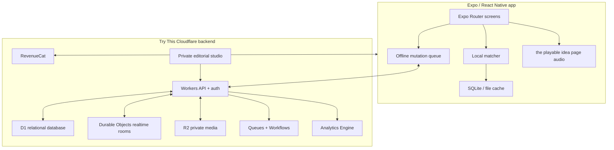
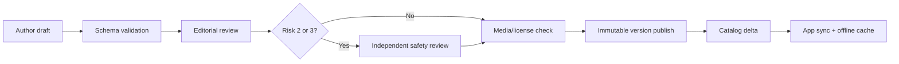

# Try This — Technical Specification

**Status:** Proposed architecture  
**Reference implementation:** `shaale-app`  
**Goal:** Reuse Shaale's proven mobile patterns without coupling the two products or their data.

## 1. Architecture summary

Try This should be a standalone Expo application in the `Bonding` product folder when implementation begins. It may reuse patterns and carefully extracted components from Shaale, but it must have its own package name, EAS project, Cloudflare resources, RevenueCat project or entitlement set, analytics namespace, privacy policy, and store listings.

The sibling `/connectplay` directory is a static HTML/CSS/JavaScript prototype, not an Expo codebase. Preserve it as an independent source browser and acquisition snapshot. Do not import its JSON directly at runtime; use a validated editorial conversion to produce versioned Try This records. See `CONNECTPLAY_IMPLEMENTATION_AUDIT.md`.

**Architecture decision:** all application-owned backend services live in Try This's existing Cloudflare account. Supabase and Clerk are not dependencies. “All Cloudflare” does not include platform utilities that Cloudflare cannot replace: Apple/Google identity attestation, App Store/Play Store billing, APNs/FCM push delivery, or EAS native builds.

The defining technical requirement is **local-first activity delivery**. A parent must be able to open a saved or recently matched activity, enter the playable idea page, hear cues, complete it, and record a result without a network connection.



## 2. Proposed stack

### Mobile client

| Layer | Choice | Rationale |
| --- | --- | --- |
| Framework | Expo SDK 54 | Matches Shaale's current production baseline |
| UI runtime | React Native 0.81.5, React 19.1 | Matches Shaale; reduces unfamiliar build risk |
| Language | TypeScript 5.9, strict mode | Shared engineering practices and safer content models |
| Navigation | Expo Router 6 | File-based routing, deep links, modal/full-screen the playable idea page |
| Styling | React Native `StyleSheet` + typed tokens | Matches Shaale's implementation; no NativeWind dependency required |
| Auth | Try This Workers auth service | Verifies Apple/Google identity tokens, issues rotating Try This sessions, and stores only server-side token hashes in D1 |
| Database | Cloudflare D1 + Drizzle ORM | Relational content, families, profiles, outcomes, invitations, and entitlement mirror |
| Realtime coordination | SQLite-backed Durable Objects | One object per active family/invite/session room; hibernating WebSockets only where realtime is actually needed |
| Storage | Cloudflare R2 | Original diagrams, short demo loops, downloadable audio, exports, and optional encrypted memories |
| Background work | Cloudflare Queues + Workflows | Idempotent analytics ingestion, catalog publication, export, deletion, and webhook processing |
| Analytics | Cloudflare Analytics Engine + privacy-safe D1 rollups | High-volume operational events plus durable aggregate product metrics |
| Local persistence | SQLite for catalog/history; AsyncStorage for small preferences | Queryable offline catalog without overloading key-value storage |
| Secure persistence | Expo SecureStore | Auth tokens and device-scoped secrets only |
| Network state | `@react-native-community/netinfo` | Offline banner and sync behavior |
| Media | `expo-audio`, `expo-video`, `expo-file-system` | Downloadable audio cues and short demonstrations |
| Notifications | `expo-notifications` | User-controlled activity windows |
| Purchases | RevenueCat | iOS/Android subscription handling and family entitlement |
| Error isolation | React Error Boundaries by route and the playable idea page | A failed activity must not blank the app |
| Testing | Jest + React Native Testing Library + Maestro/Detox decision spike | Unit, component, and critical-flow tests |

### Important Shaale invariant

Shaale currently requires:

```json
{
  "expo": {
    "newArchEnabled": false
  }
}
```

Its production notes state that React Native 0.81.5 with iOS 26 crashes under the new architecture and depends on a patch-package fix. If Try This pins the same React Native baseline, it must begin with `newArchEnabled: false` and copy the verified patch only after reviewing its applicability. This is not a permanent product requirement: reassess when upgrading Expo/React Native, and do not blindly carry the workaround to an unaffected version.

### Backend

- One public Cloudflare Worker is the only application API boundary.
- D1 stores relational product state. Foreign keys are enabled and every query is scoped by the authenticated family membership.
- R2 stores private media and export archives. Objects are never public; the Worker returns short-lived signed download URLs after authorization.
- SQLite-backed Durable Objects provide strongly consistent coordination for active family sessions and invitation redemption. They are not the primary database.
- Queues absorb retryable writes and webhook bursts; Workflows run multi-step export/deletion and catalog publication jobs.
- Analytics Engine receives allowlisted event dimensions; scheduled Workers write only aggregate retention/product metrics to D1.
- Turnstile protects public web forms and guest-link redemption where appropriate.
- No paid generative-AI endpoint in the MVP.

This architecture deliberately avoids KV as a source of truth. KV may later cache public catalog metadata, but its eventual consistency is inappropriate for memberships, entitlements, invitations, or deletion state.

### Is the Cloudflare-only backend practical?

Yes, for this workload. Try This is read-heavy, local-first, has modest relational data, and does not require arbitrary SQL access from the client. That is a good fit for Workers + D1.

| Need | Cloudflare service | Fit and constraint |
| --- | --- | --- |
| Relational product data | D1 | Good fit for the MVP. D1 is SQLite, not Postgres; use SQLite-compatible types and plan before any single database approaches its 10 GB paid-plan limit. |
| Authorization | Worker policy layer | Feasible, but there is no database RLS safety net. The Worker-only data boundary and cross-family integration tests are mandatory. |
| Transactions | D1 batches/transactions | Good for bounded relational writes. Keep operations short, indexed, and below Worker/D1 query limits. |
| Realtime family room | Durable Object per room | Strong fit. It serializes room state and supports hibernating WebSockets without turning D1 into a presence server. |
| Files and media | Private R2 | Strong fit. Treat temporary download URLs as bearer credentials and keep expiries short. |
| Background jobs | Queues + Workflows | Strong fit if all consumers are idempotent; Queues is at-least-once and can deliver duplicates. |
| Backups | D1 Time Travel + scheduled R2 export | Time Travel covers 30 days on Workers Paid; encrypted periodic exports to a retention-locked R2 bucket provide longer recovery. |
| Analytics | Analytics Engine + D1 aggregates | Good for aggregate trends, not as the canonical ledger for user-visible history or billing. |
| Full-text content search | Local SQLite first; D1 FTS only after a spike | Explore should remain local in v1. Validate language/tokenization quality before relying on server search. |

Operational guardrails:

- use the Workers Paid plan for production;
- create separate D1 databases, R2 buckets, queues, Durable Object namespaces, and secrets for preview and production;
- add indexes for every family-scoped lookup and inspect D1 query metadata in load tests;
- make Queue consumers and Workflow steps idempotent;
- export D1 to encrypted R2 snapshots on a documented schedule in addition to Time Travel;
- retain a future escape hatch: repository interfaces keep D1-specific SQL out of domain logic, so a later database migration does not require rewriting the app.

Relevant Cloudflare references: [D1 limits](https://developers.cloudflare.com/d1/platform/limits/), [D1 Time Travel and backups](https://developers.cloudflare.com/d1/reference/time-travel/), [Durable Objects](https://developers.cloudflare.com/durable-objects/), [R2 presigned URLs](https://developers.cloudflare.com/r2/api/s3/presigned-urls/), and [Queues delivery guarantees](https://developers.cloudflare.com/queues/reference/delivery-guarantees/).

## 3. Repository layout

Proposed implementation layout:

```text
Bonding/
├── app/
│   ├── _layout.tsx
│   ├── onboarding.tsx
│   ├── activity/[id].tsx
│   ├── sign-in.tsx
│   └── (tabs)/
│       ├── _layout.tsx
│       ├── index.tsx
│       ├── our-things.tsx
│       └── grown-ups.tsx
├── src/
│   ├── components/
│   ├── data/
│   ├── hooks/
│   ├── lib/
│   ├── services/
│   ├── theme/
│   ├── types/
│   └── validation/
├── assets/
├── cloudflare/
│   ├── migrations/
│   ├── src/
│   │   ├── api/
│   │   ├── auth/
│   │   ├── durable-objects/
│   │   ├── queues/
│   │   └── workflows/
│   ├── seed/
│   ├── test/
│   └── wrangler.jsonc
├── content/
│   ├── activities/
│   ├── packs/
│   └── schemas/
├── scripts/
├── tests/
├── app.json
├── eas.json
├── package.json
└── tsconfig.json
```

All implementation files for this product should remain under `Bonding/`.

## 4. Route model

| Route | Purpose |
| --- | --- |
| `/onboarding` | Local-first setup and first moment |
| `/(tabs)` | Shell for Today, Saved, and Profile |
| `/(tabs)/index` | Moment questions followed by one recommendation |
| `/activity/[id]` | Complete playable idea: start, materials, steps, safety, variants |
| `/sign-in` | Deferred adult account creation |
| `/family/invite/[token]` | Adult caregiver invitation |
| `/guest/activity/[token]` | Redacted, time-limited guest activity |
| `/subscription` | RevenueCat paywall |
| `/privacy` | Data controls, export, deletion |

The activity route is the complete playable experience and should be wrapped in
its own Error Boundary. It must not introduce a second “start” route.

## 5. Domain model

### Core types

```ts
type AgeBand = "3-4" | "5-6" | "7-8" | "9-10";
type ActivityMode = "make" | "move" | "think" | "talk" | "help" | "perform";
type Energy = "empty" | "steady" | "energetic";
type ChildState = "calm" | "wiggly" | "frustrated" | "curious" | "unspecified";
type Place = "home" | "outside" | "travel" | "waiting" | "bedtime";
type Mess = "none" | "contained" | "fine";
type RiskLevel = 0 | 1 | 2 | 3;
type Fit = "yes" | "almost" | "no";

interface Moment {
  childProfileIds: string[];
  adultCount: number;
  durationBucket: "2-5" | "5-10" | "10-20" | "20-45" | "45+";
  adultEnergy: Energy;
  childState: ChildState;
  place: Place;
  messTolerance: Mess;
  noiseTolerance: "quiet" | "normal" | "loud";
  availableMaterialIds?: string[];
}
```

Conversation games add a smaller fit model:

```ts
type OralMechanic =
  | "observe"
  | "deduce"
  | "chain"
  | "accumulate"
  | "transform"
  | "alternate"
  | "inhibit"
  | "reveal"
  | "rhythm"
  | "quiet-movement";

interface ConversationGameFit {
  situations: Array<"car" | "restaurant" | "queue" | "bedtime" | "dinner">;
  volume: "silent" | "quiet" | "normal";
  interruptibility: "immediate" | "end-of-turn" | "end-of-round";
  cognitiveLoad: "low" | "medium" | "high";
  driverSafe: boolean;
  languageCodes: string[];
}
```

The full activity schema is defined in `CONTENT_SYSTEM.md`.

## 6. Database design

Use UUIDv7 text primary keys, integer Unix timestamps, SQLite-compatible JSON text, and explicit schema-version fields. Drizzle generates SQL migrations committed under `cloudflare/migrations/`. Do not store raw analytics and product state in the same tables.

### Adult and family tables

#### `families`

- `id`
- `owner_user_id`
- `display_name` nullable
- `timezone`
- `subscription_tier`
- `created_at`
- `deleted_at`

#### `family_members`

- `family_id`
- `user_id`
- `role`: owner, caregiver, viewer
- `status`: invited, active, removed
- `created_at`

#### `child_profiles`

- `id`
- `family_id`
- `nickname_ciphertext` nullable
- `age_band`
- `interest_modes`
- `avoidance_flags`
- `accessibility_preferences_json` validated JSON text
- `created_at`
- `deleted_at`

Nicknames may be encrypted application-side if cloud sync is enabled. The matcher should use profile IDs, not nicknames.

### Content tables

#### `activities`

- `id`
- `slug`
- `status`: draft, review, published, retired
- `schema_version`
- `mode`
- `title`
- `one_line_promise`
- `age_bands`
- `duration_min/max`
- `adult_energy`
- `places`
- `mess`
- `noise`
- `participant_min/max`
- `risk_level`
- `supervision`
- `instructions`
- `together_mode`
- `accessibility`
- `editorial_score`
- `published_version_id`

#### `activity_versions`

Immutable published snapshots with:

- body payload;
- reviewer IDs;
- safety review timestamp;
- provenance;
- original demonstration URL, platform, creator credit, availability state, and whether it is permitted as an instruction fallback;
- media license records;
- content hash.

An activity session always references a version, so historical safety and instruction state remains auditable.

#### `materials`

- canonical ID and name
- aliases
- hazard metadata
- substitutions
- default-household probability

#### `activity_materials`

- activity version
- material
- quantity
- required/optional
- prep note
- safe substitutions

#### `activity_packs`

Curated collections such as “Waiting without screens” and their ordered activity/version members.

#### `conversation_games`

Lightweight, versioned oral-game records:

- title and traditional names;
- origin and attribution notes;
- oral mechanic;
- one-breath rule;
- opening line;
- situations;
- volume and interruptibility;
- cognitive, visual, speech, hearing, and touch demands;
- driver-safe flag;
- cooperative default;
- easier, harder, mixed-age, and child-remix variants;
- language-specific rule data;
- fluent reviewer IDs.

These may share publication infrastructure with activities but should not require materials, prep, cleanup, media, or timed steps.

### Session tables

#### `together_sessions`

- `id`
- `family_id`
- `activity_version_id`
- `moment_snapshot_json` validated, redacted JSON text
- `started_at`
- `completed_at`
- `fit`
- `swap_reason`
- `completion_mode`
- `device_id_hash`

Do not store the child's name, photo, or free-text note here.

#### `activity_preferences`

Aggregated per family/activity mechanic:

- positive/negative count;
- last performed;
- repeat count;
- preferred modes;
- constraint mismatch counts.

#### `private_memories`

Optional, separate from session analytics:

- `family_id`
- `session_id`
- encrypted note
- private storage object ID
- local-only/cloud-backed flag

### Editorial and safety tables

- `content_reviews`
- `safety_reviews`
- `media_licenses`
- `content_reports`
- `publication_audit_log`

## 7. Authorization boundary

D1 does not provide Supabase-style database Row Level Security. Therefore, the mobile app never receives database credentials and never queries D1 directly. Every request passes through the Worker, which verifies the Try This session and applies authorization before executing a prepared query.

Policy principles:

- A centralized `authorizeFamilyAction(actor, familyId, action)` policy module is mandatory; route handlers may not hand-roll membership checks.
- Adult users may access rows only after an active `family_members` lookup for the requested family.
- Every family-owned repository method requires `familyId` as a non-optional argument and includes it in its SQL predicate.
- Viewers may not modify child profiles or private memories.
- Guest token hashes are stored in D1. The Worker validates expiry, revocation, and scope, then returns a redacted payload without querying unrelated family data.
- Editorial endpoints require an explicit staff role and Cloudflare Access for the browser-based studio.
- R2 keys use unguessable family-scoped prefixes; download URLs are short-lived and issued only after the same policy check.
- Durable Object connections receive a signed, narrow capability containing room ID, actor ID, role, and expiry.
- Removing a member increments the family's authorization epoch, invalidating cached capabilities and sessions.

Integration tests use two users and two families and must prove cross-family denial for reads, inserts, updates, R2 objects, exports, guest links, and realtime rooms. Because enforcement is application-level, these tests and the centralized repository boundary are release-blocking.

## 8. Local-first storage

### SQLite

Store:

- published activity catalog subset;
- material graph;
- packs;
- downloaded media manifest;
- recent activity IDs;
- pending session outcomes;
- content version metadata.

### AsyncStorage

Store only small values:

- onboarding complete;
- current family/profile selection;
- moment defaults;
- notification preference;
- non-sensitive UI preference.

### SecureStore

- rotating Try This access/refresh session
- device installation secret
- encryption key material for optional local private notes

### File system

- activity diagrams;
- short demo loops;
- audio guides;
- local-only private photos.

### Offline queue

Mutations have:

- client-generated idempotency key;
- table/action;
- sanitized payload;
- created time;
- retry count;
- last error class.

Retries use exponential backoff and stop on authorization or schema errors. A failed sync must never block a Together Session.

## 9. Matching engine

### MVP: deterministic local scoring

Do not begin with an LLM.

```text
eligible =
  published
  AND age intersects
  AND place supports
  AND participant count fits
  AND risk allowed by profile
  AND required materials available or baseline-safe
  AND accessibility exclusions absent

score =
  30 * time_fit
  + 20 * adult_energy_fit
  + 15 * child_state_fit
  + 10 * preference_fit
  + 10 * novelty
  + 10 * editorial_quality
  + 5  * pack/context_fit
  - repetition_penalty
  - prior_mismatch_penalty
```

The matcher returns:

- selected activity;
- two fallback IDs cached but not displayed;
- explanation codes;
- hard constraints used;
- model/rules version.

The unified matcher includes conversation-specific constraints—situation, driver safety, volume, language, access needs, and interruptibility—without exposing a separate product route. It ranks every eligible idea together and must return locally in under 50 ms without a network call.

### Later: learned ranking

Only after sufficient data:

- Train or fit a lightweight ranker on de-identified structured signals.
- Keep hard safety/accessibility filters outside the model.
- Log feature version and explanation.
- Run shadow evaluation before changing recommendations.
- Never use private notes or photos as features.

## 10. Content delivery and publication

### Source of truth

Human-readable YAML/JSON files in `Bonding/content/activities/` should be version controlled and validated.

### Publication flow



### Validation

Build should fail when:

- required structured fields are absent;
- time or age ranges are invalid;
- a material lacks hazard metadata;
- Level 2/3 content lacks the required review;
- media license fields are missing;
- a prompt instructs child appearance scoring;
- copy contains prohibited development claims;
- a retired source asset is referenced.

For source-first alpha activities, publication also fails unless the record has a current link check, user-visible source credit where known, an adult-gated external-link label, and enough first-party material/safety context to explain what the family is about to attempt. Removed, blank, ambiguous, or unsafe demonstrations cannot be the instruction fallback.

## 11. Playable idea-page implementation

The `/activity/[id]` route renders either a hands-on activity or conversation
game through the unified catalog adapter. It is intentionally stateless beyond
the optional saved flag. There is no active-session state machine, second start
route, forced completion prompt, or background/resume workflow.

### Audio

- Prefer authored short clips or on-device TTS for non-branded utility prompts.
- Cache all required cues before start.
- Audio never contains advertising or unrelated recommendations.
- Respect silent mode according to explicit user setting.
- Provide captions and haptics where helpful.

### App lifecycle

- Backgrounding and returning leaves the idea page where it was.
- An incoming phone call does not create or abandon a session.
- Optional timers, if introduced for a specific idea later, must remain inline
  and must not recreate a global play mode.

## 12. Authentication

### Local-first identity

On first launch:

- create a random installation ID;
- keep profiles and history local;
- allow full free loop.

### Account upgrade

When the adult chooses sync, family sharing, cloud memories, or subscription restore:

- use native Sign in with Apple and Google Sign-In;
- send the resulting identity token and PKCE/nonce proof to the Try This Worker;
- verify issuer, audience, signature, nonce, and expiry against the provider's published keys;
- upsert the provider identity in D1 and issue a short-lived access token plus rotating opaque refresh token;
- store only a hash of each refresh token in D1, bind it to an installation, rotate on every use, and revoke the token family on reuse;
- merge local state into the new family using idempotent operations;
- never discard local history on sign-in failure.

Do not build passwords or an email-delivery system for v1. Apple is required on iOS when another third-party sign-in is offered. An email fallback would require an external mail delivery provider even if token generation and state remained on Cloudflare.

### Adult assurance

The product is adult-operated. Add a simple adult gate before subscription, external links, family invitations, data export/deletion, or cloud photo enablement. Avoid knowledge questions children can trivially answer; use platform authentication where appropriate.

## 13. Purchases

RevenueCat configuration:

- entitlement: `try_this_plus`
- offerings: monthly, annual
- one family entitlement mapped to the adult purchaser
- RevenueCat webhook reaches a dedicated Worker route, is signature-verified, deduplicated, queued, and mirrors entitlement state to D1
- app trusts current RevenueCat state for immediate UI and the mirrored state for backend authorization

Required states:

- free;
- trial;
- active;
- grace period;
- billing issue;
- expired;
- VIP/test entitlement.

Subscription must not gate safety details, already downloaded activities, data export, or deletion.

## 14. Analytics and telemetry

### Separation

Try This must use a new analytics table or project namespace. Do not write to Shaale's `analytics_events`, and never combine Try This telemetry with Shaale web or native metrics.

### Event envelope

- event name;
- timestamp;
- app version/build;
- platform;
- environment;
- anonymous installation hash;
- adult user ID nullable;
- family ID hash nullable;
- subscription tier;
- matcher version;
- structured properties allowlist.

### Prohibited analytics fields

- child nickname;
- exact age or birth date;
- photo URI;
- free-text note;
- accessibility narrative;
- precise location;
- raw guest token;
- identity-provider tokens or Try This session tokens.

### Reliability

- local event queue;
- batch upload;
- idempotency key;
- environment stamping;
- event-name registry and tests;
- server-side retention policy.

Shaale's production lessons should be carried over: enumerate actual event names before building reports, stamp app version and environment, and never treat a regenerated device ID as a unique person.

## 15. Notifications and widget

### Permission flow

Request only after the adult selects a reminder window or adds the widget. Explain what will be sent first.

### Scheduling

- local notifications for saved windows;
- server push only for cross-device/family events;
- max-frequency guard;
- timezone-aware;
- no notification content containing child names by default.

### Widget

- displays title, duration, and up to three materials;
- reads from a shared app-group cache;
- tapping deep-links to `/activity/[id]`;
- family data never appears on a lock screen unless explicitly enabled.

## 16. Security

Follow root `SECURITY.md`.

### Non-negotiables

- No secret in source, content, fixture, or markdown.
- Only publishable identity-provider and RevenueCat identifiers may use `EXPO_PUBLIC_`.
- Webhook, session-signing, OAuth-client, and R2 signing secrets live in Cloudflare secrets.
- Paid endpoints require adult auth and server-side rate limits.
- Inputs validated server-side with Zod or equivalent.
- CORS locked to explicit origins.
- Generic client errors; detailed server logs without PII.
- Signed, expiring guest links.
- Content and media payloads treated as untrusted.

### Threat model highlights

| Threat | Control |
| --- | --- |
| Cross-family child data access | Worker policy boundary + family-scoped queries + integration tests |
| Leaked guest activity link | Short expiry, redacted payload, revocation, no profile/history |
| Malicious content submission | No public publication; schema validation; review queue |
| Unsafe AI output | No free-form activity generation; constrained approved graph |
| Photo exposure | Local by default, private R2 bucket, opt-in cloud, metadata stripping |
| Subscription spoofing | RevenueCat SDK plus webhook mirror |
| Device theft | platform encryption, SecureStore, optional local app lock |
| Analytics leakage | property allowlists and CI tests |

## 17. Privacy and deletion

### Data map

Document:

- what is local only;
- what syncs;
- processor;
- retention;
- export format;
- deletion behavior.

### Deletion

Family owner can:

- delete a child profile;
- delete private memories only;
- leave a family;
- delete the entire account/family.

Deletion workflow:

1. immediate UI removal and access revocation;
2. soft-delete tombstone for retry safety;
3. a Cloudflare Workflow deletes D1 rows and R2 objects in idempotent stages;
4. processor cleanup where supported;
5. completion receipt without exposing internal IDs.

Backups follow a documented expiry schedule.

## 18. Testing strategy

### Unit tests

- matcher hard constraints and scoring;
- safety exclusion logic;
- age/multi-child variants;
- schema validation;
- offline queue and idempotency;
- subscription state;
- event property allowlists;
- timer/background state machine.

### Component tests

- first activity flow;
- swap reason;
- safety acknowledgement;
- Dynamic Type;
- screen reader labels;
- offline activity detail;
- sync conflict states.

### End-to-end

1. Fresh install → first Together Session without account
2. Offline launch → downloaded activity completion
3. Sign in → merge local history
4. Subscribe → entitlement unlock
5. Multi-child match
6. Guest link with valid, expired, and revoked token
7. Family A cannot access Family B
8. Delete child profile and verify storage cleanup
9. Background and resume the playable idea page
10. Notification deep link to activity prep

### Content QA

- automated schema checks;
- manual safety checklist;
- real-family playtest;
- cleanup-time check;
- material availability check;
- “child can change the rules” check;
- copy/claim review;
- media-license verification.

## 19. CI/CD

### Pull request gates

- TypeScript
- ESLint with `react-hooks/rules-of-hooks: error`
- unit/component tests
- content schema validation
- migration lint
- cross-family authorization test suite
- secret scan
- asset-license check
- bundle-size threshold

### Release

- EAS development, preview, and production profiles
- separate iOS/Android credentials
- Sentry or equivalent privacy-configured crash reporting, or first-party crash events if sufficient
- staged Android rollout
- TestFlight external beta
- App Store Connect is authoritative for iOS upload/review state

### Versioning

- runtime version by app version
- commit post-build version bumps
- content catalog version independent of binary version
- immutable activity versions

## 20. Performance budgets

- Warm app-to-Today interactive: under 1 second on a mid-tier device
- Cold app-to-Today interactive: under 2.5 seconds with local catalog
- Recommendation computation: under 50 ms for cached catalog
- the playable idea page route transition: under 250 ms perceived
- Base binary target: under 45 MB before optional downloads
- Starter offline catalog: under 15 MB
- Individual activity media bundle: generally under 2 MB
- No network request required to render Today after initial catalog install

## 21. Build sequence

### Milestone 1 — skeleton and content contracts

- Expo project
- routing
- tokens
- activity schema/validator
- 10 local activities
- deterministic matcher

### Milestone 2 — core loop

- onboarding
- Today
- prep
- the playable idea page
- local close/fit signal
- offline persistence

### Milestone 3 — catalog

- 60–120 activities
- Explore
- favorites
- downloads
- content QA pipeline

### Milestone 4 — accounts and business

- Try This Workers auth
- D1 sync and authorization policy layer
- R2 private media
- Queues/Workflows for webhooks, export, and deletion
- RevenueCat
- family members
- privacy controls

### Milestone 5 — release readiness

- notifications/widget
- accessibility audit
- security review
- legal/media review
- beta analytics
- store assets

## 22. Technical decisions to validate

1. SQLite package choice compatible with Expo SDK 54 and content-delta needs.
2. Whether Try This should use one D1 database per environment or a shared database with environment columns. Recommendation: separate development, preview, and production databases.
3. Whether private memories belong in v1. Recommendation: local-only photo support at most.
4. Whether accounts are needed before family sharing. Recommendation: defer all authentication until sync, sharing, restore, or cloud memories creates clear value.
5. Whether audio should use authored recordings or on-device TTS. Recommendation: authored cues for launch packs, with text fallback.
6. Whether the unrelated “Try This” App Store listing makes the working name nonviable.
